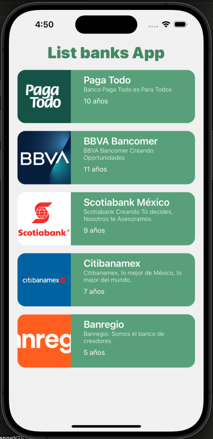
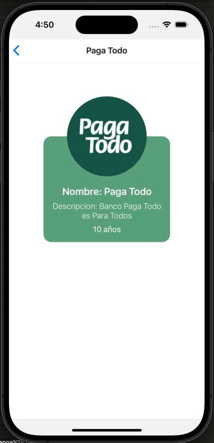

# LIST BANKS APP




## What I did? :man_technologist: :iphone:

- I developed an app with bare React Native for iOS and Android.

- The app uses [React Navigation](https://reactnavigation.org/) to handle navigation such as native navigation, and [Async Storage](https://react-native-async-storage.github.io/async-storage/) to handle the storage.

- The app has TypeScript to prevent errors and help to suggest code.

- The app save the information on a local storage to prevent refetch.

## Problems! :sweat: :hammer_and_wrench:

- I had a problem with run app on android because i have a basic mac and I have full fill storage, but the code is cross platform and it should work.

- I tried use a key-value storage library for persistence data called [mmkv](https://github.com/mrousavy/react-native-mmkv/issues/723) but the library is not working with my current version of react native, and the issue is not solved yet.

# Getting Started

This is a new [**React Native**](https://reactnative.dev) project, bootstrapped using [`@react-native-community/cli`](https://github.com/react-native-community/cli).

> **Note**: Make sure you have completed the [React Native - Environment Setup](https://reactnative.dev/docs/environment-setup) instructions till "Creating a new application" step, before proceeding.

## Step 1: Install dependecies and modules

You need install _dependecies_, _modules_ and _pods_.

```bash
# using npm
npm install

# using yarn
yarn add
```

And install _pods_

```bash
# install pods
cd ios
pod install
```

## Step 2: Start the Metro Server

Then, you will need to start **Metro**, the JavaScript _bundler_ that ships _with_ React Native.

To start Metro, run the following command from the _root_ of your React Native project:

```bash
# using npm
npm start

# OR using Yarn
yarn start
```

## Step 3: Start your Application

Let Metro Bundler run in its _own_ terminal. Open a _new_ terminal from the _root_ of your React Native project. Run the following command to start your _Android_ or _iOS_ app:

### For Android

```bash
# using npm
npm run android

# OR using Yarn
yarn android
```

### For iOS

```bash
# using npm
npm run ios

# OR using Yarn
yarn ios
```

If everything is set up _correctly_, you should see your new app running in your _Android Emulator_ or _iOS Simulator_ shortly provided you have set up your emulator/simulator correctly.

This is one way to run your app — you can also run it directly from within Android Studio and Xcode respectively.

## Congratulations! :tada:

You've successfully run your LIST BANKS APP. :partying_face:
